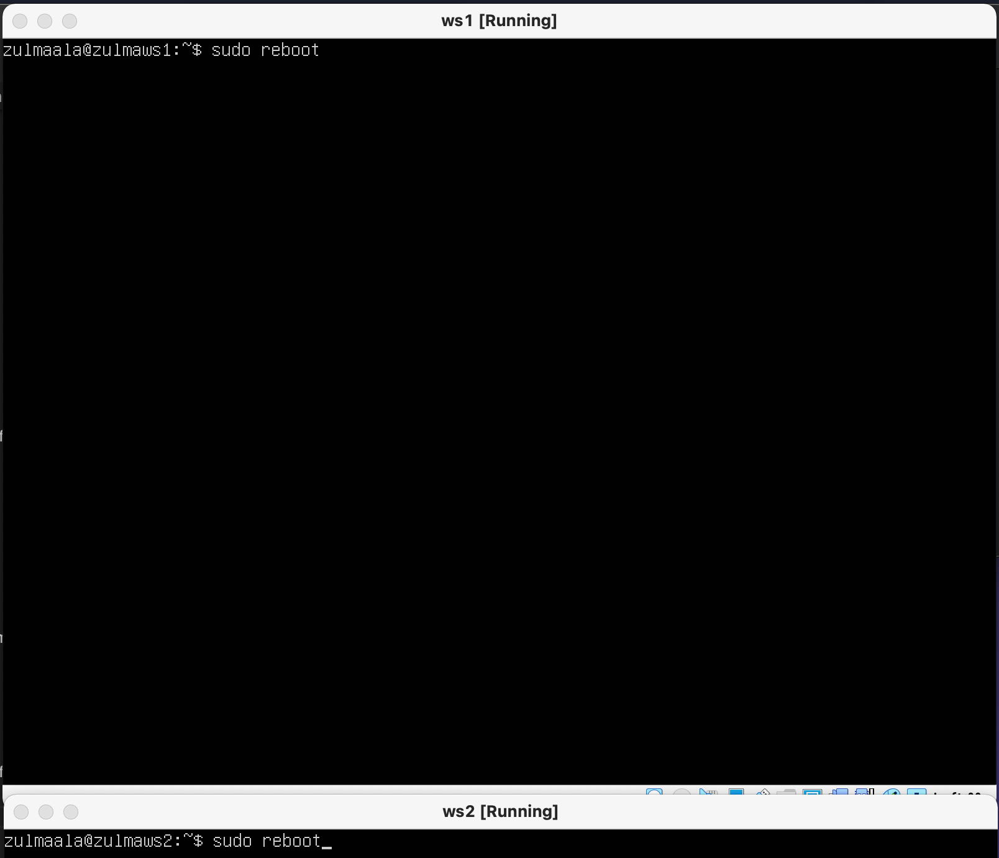
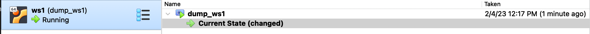

## Part 1. ipcalc tool

- there is no ipcalc tool.


- installing ipcalc. $ sudo apt install ipcalc


### 1.1 Networks and Masks

1. Network address of 192.167.38.54/13


2. Conversion of the mask 255.255.255.0 to prefix and binary, /15 to normal and binary, 11111111.11111111.11111111.11110000 to normal and prefix

- сonversion of the mask 255.255.255.0 to prefix and binary


- /15 to normal and binary


- 11111111.11111111.11111111.11110000 to normal and prefix


3. Minimum and maximum host in 12.167.38.4 network with masks: /8, 11111111.11111111.00000000.00000000, 255.255.254.0 and /4

- /8


- 11111111.11111111.00000000.00000000


- 255.255.254.0


- /4


### 1.2 Localhost
It's ranged form 127.0.0.1 - 127.255.255.255.255 in that case
- can be accessed with: 127.0.0.2, 127.1.0.1
- can't with: 194.34.23.100 ,128.0.0.1
### 1.3. Network ranges and segments

1. Which of the listed IPs can be used as public and which only as private: 10.0.0.45, 134.43.0.2, 192.168.4.2, 172.20.250.4, 172.0.2.1, 192.172.0.1, 172.68.0.2, 172.16.255.255, 10.10.10.10, 192.169.168.1

- private
    + 10.0.0.45
    + 192.168.4.2
    + 172.20.250.4
    + 172.16.255.255
    + 10.10.10.10
- public
    + 134.43.0.2
    + 172.0.2.1
    + 192.172.0.1
    + 172.68.0.2
    + 192.169.168.1

2. Which of the listed gateway IP addresses are possible for 10.10.0.0/18 network: 10.0.0.1, 10.10.0.2, 10.10.10.10, 10.10.100.1, 10.10.1.255
- possible
    + 10.10.0.2
    + 10.10.10.10
    + 10.10.1.255
- impossible
    + 10.0.0.1
    + 10.10.100.1


## Part 2. Static routing between two machines

- Start two virtual machines (hereafter -- ws1 and ws2)


- View existing network interfaces with the ip a command 
    - Add a screenshot with the call and output of the used command to the report.


- Describe the network interface corresponding to the internal network on both machines and set the following addresses and masks: ws1 - 192.168.100.10, mask */16 *, ws2 - 172.24.116.8, mask /12
- Add screenshots of the changed etc/netplan/00-installer-config.yaml file for each machine to the report.
- sudo nano /etc/netplan/00-installer-config.yaml


- sudo netplan apply


- after network applied


### 2.1. Adding a static  route manually

- Add a static route from one machine to another and back using a 'ip r add' command.


- Ping the connection between the machines. Add a screenshot with the call and output of the used commands to the report.


### 2.2. Adding a static route with saving

- Restart the machines


- Add static route from one machine to another using etc/netplan/00-installer-config.yaml file. Add screenshots of the changed etc/netplan/00-installer-config.yaml
file to the report.


- Ping the connection between the machines. Add a screenshot with the call and output of the used commands to the report.


## Part 3. iperf3 utility
### 3.1. Connection speed
* Convert given network speed:
* `8 Mbps`   == `1 MB/s` (google) | `1 MB/s` (school and it's based on how memory of computer send data to networks)
* `100 MB/s` == `100000 Kbps`     | `819200 Kbps`
* `1 Gbps`   == `1000 Mbps`       | `1024 Mbps`
### 3.2. iperf3 utility
- Measure connection speed between ws1 and ws2. Add a screenshots with the call and output of the used commands to the report.

    `sudo apt install iperf3`
   + On the server $ iperf3 -s
   + On the client $ iperf3 -c 192.168.100.10


## Part 4. Network firewall

### 4.1. iptables utility

- Create a /etc/firewall.sh file simulating the firewall on ws1 and ws2 - creating /etc/firewall.sh with command 'sudo nano /etc/firewall.sh' and entering the 'flush' and 'delete chain' A chain is a sequence of rules applied in order.There are three built-in chains (INPUT, OUTPUT and FORWARD) commands:


The following rules should be added to the file in a row:

+ 1 - on ws1 apply a strategy where a deny rule is written at the beginning and an allow rule is written at the end (this applies to points 4 and 5)
+ 2 - on ws2 apply a strategy where an allow rule is written at the beginning and a deny rule is written at the end (this applies to points 4 and 5)
+ 3 - open access on machines for port 22 (ssh) and port 80 (http)
+ 4 - reject echo reply (machine must not ping, i.e. there must be a lock on OUTPUT)
+ 5 - allow echo reply (machine must be pinged)

Add screenshots of the /etc/firewall file for each machine to the report.

- entering the iptable commands for ws1 and ws2 according to the instructions:


- run the files on both machines with chmod +x /etc/firewall.sh and /etc/firewall.sh commands 
    + sudo chmod +x /etc/firewall.sh
    + sudo /etc/firewall.sh
    + ping -c 5 8.8.8.8 to add some data transmission
    + listing the created rules: sudo iptables -L
Add screenshots of both files running to the report.
Describe in the report the difference between the strategies used in the first and second files.


- difference between strategies - first suitable rule met is going to be executed. Rules that are applied after are going to be ignored.
- flags explained:
- -L --list	Display the rules in the selected chain.
- -n --numeric	Display the IP address or hostname and post number in numeric format.
- -v --verbose	Provide more information when used with the list option. This option makes the list command show the interface name, the rule options.

### 4.2. nmap utility:

- We use ping command to find a machine which is not pinged, then use nmap utility to show that the machine host is up
Check: nmap output should say: Host is up.

- installing nmap - sudo apt-get install nmap


- contents of firewall.sh


- Add screenshots with the call and output of the ping and nmap commands to the report - ping and nmap:


- Save dumps of the virtual machine images
p.s. Do not upload dumps to git under any circumstances!

   + export to files

   + snapshots



## Part 5. Static network routing:
- Start five virtual machines (3 workstations (ws11, ws21, ws22) and 2 routers (r1, r2))

#### 5.1. Configuration of machine addresses
- Set up the machine configurations in *etc/netplan/00-installer-config.yaml* according to the network in the picture.
- Add screenshots of the *etc/netplan/00-installer-config.yaml* file for each machine to the report.

- Restart the network service. If there are no errors, check that the machine address is correct with the `ip -4 a`command. Also ping ws22 from ws21.
- Add screenshots with the call and output of the used commands to the report.


#### Similarly ping r1 from ws11.

#### 5.2. Enabling IP forwarding.

- To enable IP forwarding, run the following command on the routers: sysctl -w net.ipv4.ip_forward=1.
- With this approach, the forwarding will not work after the system is rebooted.


- Add a screenshot with the call and output of the used command to the report
- Open */etc/sysctl.conf* file and add the following line:
- With this approach, IP forwarding is enabled permanently.*

#### 5.3. Default route configuration
Here is an example of the `ip r' command output after adding a gateway:
```
default via 10.10.0.1 dev eth0
10.10.0.0/18 dev eth0 proto kernel scope link src 10.10.0.2
```

- Configure the default route (gateway) for the workstations. 
- Add a screenshot of the *etc/netplan/00-installer-config.yaml* file to the report.

- Call `ip r` and show that a route is added to the routing table
- Add a screenshot with the call and output of the used command to the report.

- Ping r2 router from ws11 and show on r2 that the ping is reaching. To do this, use the `tcpdump -tn -i eth1`
command.
- Add screenshots with the call and output of the used commands to the report.

#### 5.4. Adding static routes

 - Add static routes to r1 and r2 in configuration file

- Add screenshots of the changed etc/netplan/00-installer-config.yaml file for each router to the report


- Call ip r and show route tables on both routers


- Run ip r list 10.10.0.0/[netmask] and ip r list 0.0.0.0/0 commands on ws11


- Explain in the report why a different route other than 0.0.0.0/0 had been selected for 10.10.0.0/[netmask] although it could be the default route:
First IP and mask suits the route that is set in netplan (10.10.0.0/18) and the other one doesn't (one of the things that doesn't fit under the rule - 0.0.0.0/0 is out of the set mask), so it follows the default route set.

#### 5.5. Making a router list

- Run the `tcpdump -tnv -i eth0` dump command on r1
- Use **traceroute** utility to list routers in the path from ws11 to ws21


- Based on the output of the dump on r1, explain in the report how path construction works using traceroute:
First the data goes to the eth0 interface of the r1 router, then it gets routed to the second router using eth0 interface of r2 and finally gets routed to destination 10.20.0.10.
#### 5.6. Using **ICMP** protocol in routing
- In computer networking, the ICMP Internet Router Discovery  - Protocol (IRDP), also called the Internet Router Discovery Protocol,[1] is a protocol for computer hosts to discover the presence and location of routers on their IPv4 local area network.
- Run on r1 network traffic capture going through eth0 with the
`tcpdump -n -i eth0 icmp` command.

- Ping a non-existent IP (e.g. *10.30.0.111*) from ws11 with the
`ping -c 1 10.30.0.111` command.
- Add a screenshot with the call and the output of the used commands to the report.


- Save dumps of the virtual machine images
**p.s. Do not upload dumps to git under any circumstances!**

#### P5.6 ICMP

* **Catch trafic to uknown IP**
* Start the `sudo tcpdump -tnv -i eth0` on the `r2` and `ping 10.30.0.111` on `ws11`:
* We see one result on the router trafic
* 
*  We see that our router has request from our VM
## Part 6 Dynamic configuration

* **Specify dhcpd.conf**
- Specify the MAC address of ws11, for this in etc/netplan/00-installer-config.- - yaml you need to add the lines: macaddress: 10:10:10:10:10: BA, dhcp4: true.
* 

* First we need to install `$ sudo apt install isc-dhcp-server`.

- Specify the default router address, DNS server and internal network address Sample file for r2:

- In the resolv.conf file, we write nameserver 8.8.8.8.

- Restart the DHCP service with  the systemctl restart isc-dhcp-server command. Restart the ws21 machine using reboot and show via the ipa that it has received the  address. Also ping ws22 with ws21.


_Specify MAC address at ws11 by adding to etc/netplan/00-installer-config.yaml:_ \
* 
_Сonfigure r1 the same way as r2, but make the assignment of addresses strictly linked to the MAC-address (ws11):_ \


- Request an ip address update from ws21


* 
_Describe in the report what DHCP server options were used in this point:_ \
The -r flag explicitly releases the current lease, and once the lease has been released, the client exits.
_Save dumps of virtual machine images:_ OK
## Part 7. **NAT**
*In this task you need to use virtual machines from  Part 5*

##### In */etc/apache2/ports.conf* file change the line `Listen 80` to `Listen 0.0.0.0:80`on ws22 and r1, i.e. make the Apache2 server public


##### Start the Apache web server with `service apache2 start` command on ws22 and r1


##### Add the following rules to the firewall, created similarly to the firewall from Part 4, on r2:
##### 1) Delete rules in the filter table - `iptables -F`
##### 2) Delete rules in the "NAT" table - `iptables -F -t nat`
##### 3) Drop all routed packets - `iptables --policy FORWARD DROP`
##### Run the file as in Part 4


##### 4) Allow routing of all **ICMP** protocol packets
##### Run the file as in Part 4


##### Check connection between ws22 and r1 with the `ping` command

##### 5) Enable **SNAT**, which is masquerade all local ip from the local network behind r2 (as defined in Part 5 - network 10.20.0.0)
*Tip: it is worth thinking about routing internal packets as well as external packets with an established connection*
##### 6) Enable **DNAT** on port 8080 of r2 machine and add external network access to the Apache web server running on ws22
*Tip: be aware that when you will try to connect, there will be a new tcp connection for ws22 and port 80
- Add a screenshot of the changed file to the report
##### Run the file as in Part 4

##### Check the TCP connection for **SNAT** by connecting from ws22 to the Apache server on r1 with the `telnet [address] [port]` command

##### Check the TCP connection for **DNAT** by connecting from r1 to the Apache server on ws22 with the `telnet` command (address r2 and port 8080)

- telnet is an application protocol used on the Internet or local area network to provide a bidirectional interactive text-oriented communication facility using a virtual terminal connection.
## Part 8. Bonus. Introduction to **SSH Tunnels**
*In this task you need to use virtual machines from Part 5*
##### Run a firewall on r2 with the rules from Part 7


##### Start the **Apapche** web server on ws22 on localhost only (i.e. in */etc/apache2/ports.conf* file change the line `Listen 80` to `Listen localhost:80`)

##### Use *Local TCP forwarding* from ws21 to ws22 to access the web server on ws22 from ws21
For *Local TCP forwarding* we use ssh -L local_port:destination:destination_port ssh_server_ip

##### Use *Remote TCP forwarding* from ws11 to ws22 to access the web server on ws22 from ws11

